<div align="center">

# **AI Dashboard**

### *Sube tu Excel y obtén un dashboard con KPIs, gráficos, insights y predicciones al instante*

[](https://react.dev)
[](https://www.typescriptlang.org)
[](https://vite.dev)
[](https://tailwindcss.com)
[](https://www.python.org)
[](https://fastapi.tiangolo.com)

</div>

---

**AI Dashboard (Spreadsheet-to-AI Dashboard Replacer) es una aplicación web que convierte cualquier hoja de cálculo en un dashboard interactivo.**
Subes un Excel o CSV, la IA te recomienda KPIs y gráficos, tú los ajustas y en segundos tienes un panel con métricas, tendencias, insights automáticos, alertas y predicciones de futuro. Sin configurar nada y sin saber programar.

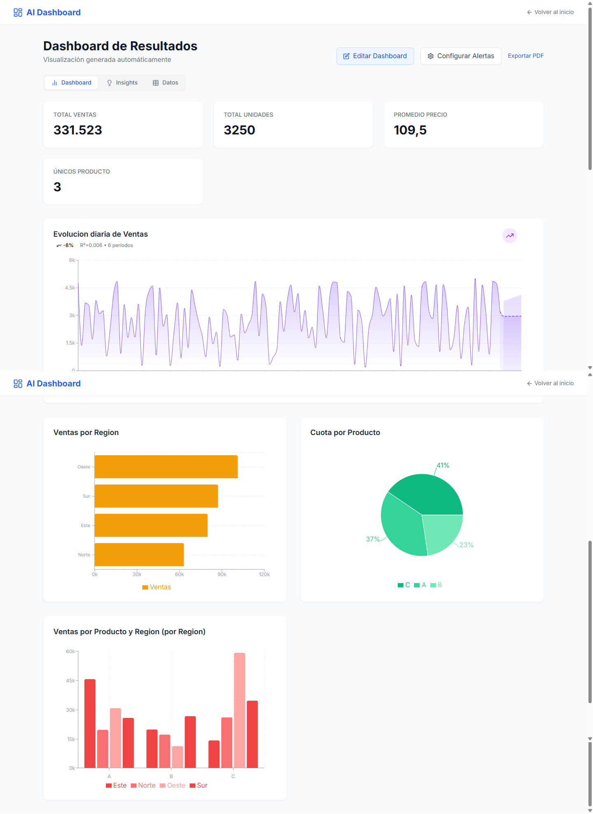

## Cómo se crea un dashboard

**1. Sube tu archivo** — arrastra tu Excel o CSV, o haz clic para seleccionarlo. La app lee las columnas y te enseña una vista previa al momento.

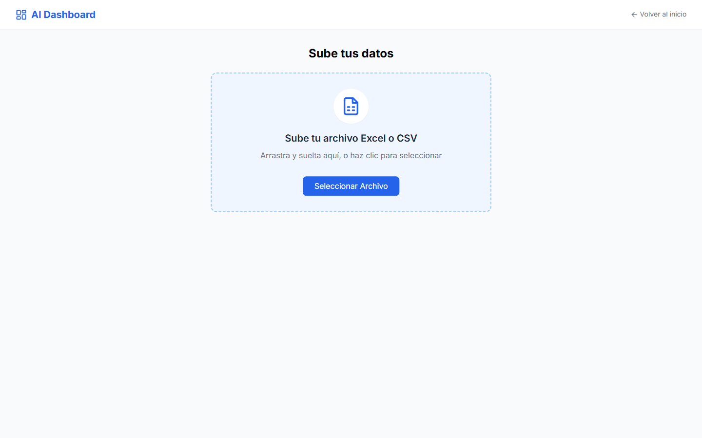

**2. Diseña tu dashboard** — configuras KPIs y gráficos sobre la vista previa de tus datos, que siempre tienes al lado.

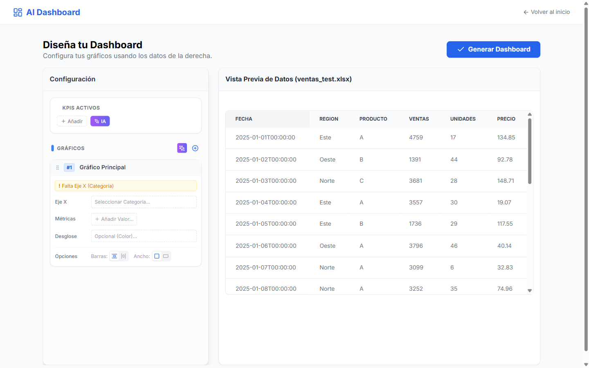

**3. Deja que la IA te ayude** — un clic en *IA* y te añade los KPIs y el gráfico con mayor valor analítico de tu fichero, ya configurados.

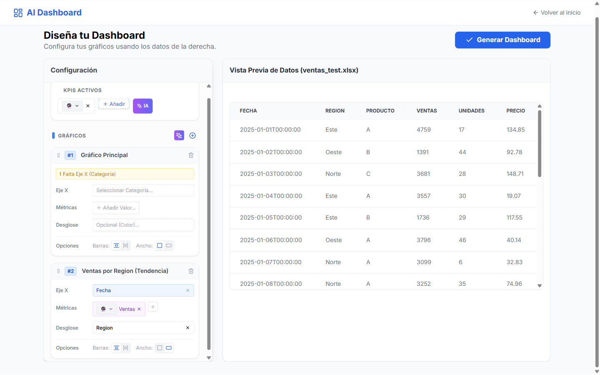

**4. Genera** — un botón y tu dashboard está listo. Se guarda en tu lista para siempre.

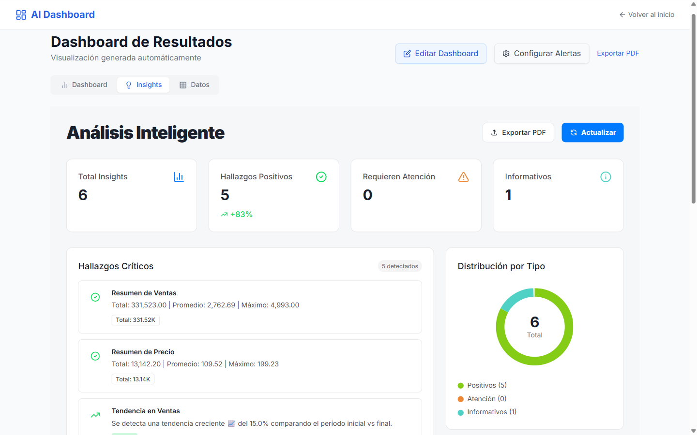

## Todo lo que puedes hacer

### Dashboards que se quedan guardados

Cada dashboard que creas queda guardado y accesible desde la pantalla de inicio. Vuelve, edita o elimina cuando quieras.

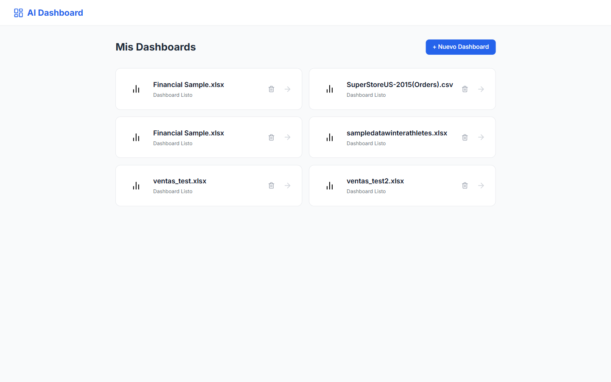

### Constructor visual con todo en una pantalla

A la izquierda configuras (KPIs con su agregación, gráficos con eje X, métricas y desglose por color), a la derecha ves el resultado aplicándose en vivo. También puedes consultar los datos fuente en crudo.

| | |
|---|---|
| 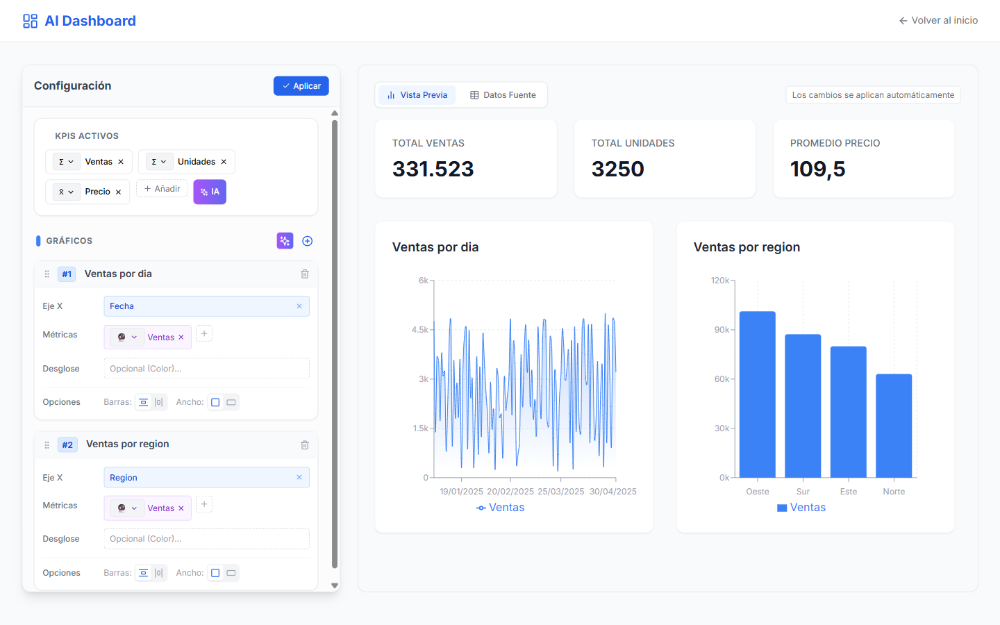 | 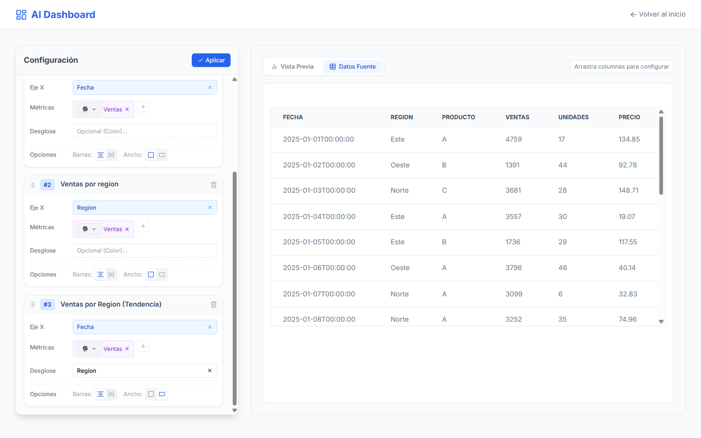 |
| **Constructor en vivo** — KPIs, gráficos, desglose y opciones de layout. | **Datos fuente** — la tabla original siempre a un clic. |

### Recomendaciones automáticas

La IA analiza tus columnas (fechas, numéricas, categóricas) y te propone los gráficos con más valor: tendencias, comparativas, desgloses. Un clic y el gráfico aparece ya montado.

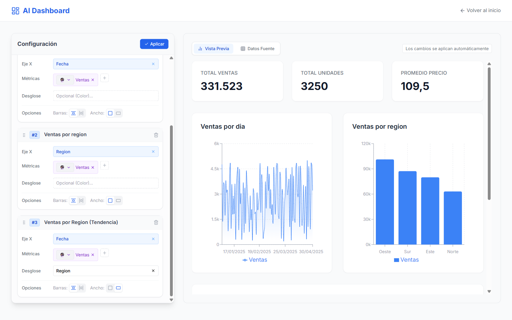

### Insights inteligentes

La app detecta por sí sola qué está pasando en tus datos: resúmenes de métricas, tendencias al alza o la baja, líderes por categoría, mejores y peores períodos. Todo priorizado por importancia y exportable a PDF.

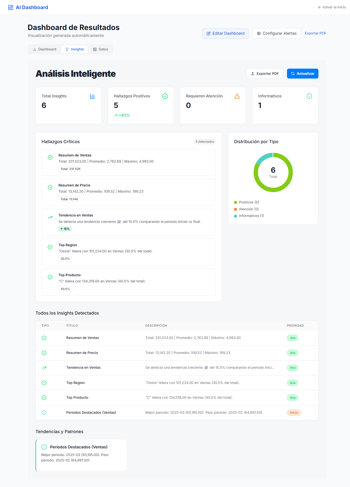

### Predicciones de futuro

En cualquier gráfico temporal, pulsa *Mostrar predicción* y la app proyecta los próximos períodos con Holt-Winters o regresión lineal (elige el mejor método automáticamente), con intervalo de confianza que crece con el horizonte.

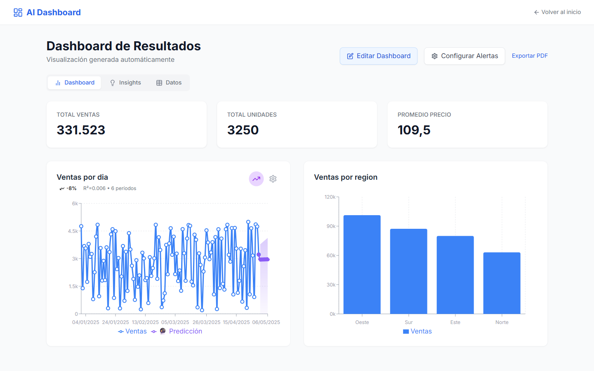

## Ponerlo en marcha (2 minutos)

```bash
git clone https://github.com/cursospotiapp/excel-to-kpi.git
cd excel-to-kpi
npm run setup        # instala backend (Python) y frontend (Node)
npm run dev:backend  # terminal 1 → API en http://localhost:8000
npm run dev:frontend # terminal 2 → web en http://localhost:5173
```

## Funcionalidades, de un vistazo

- **Sube Excel (.xlsx, .xls) y CSV** — con detección automática de encoding y separador.
- **KPIs con agregación inteligente** — suma, promedio, conteo o únicos, detectados según el tipo y nombre de columna.
- **Gráficos con desglose por color** — agrupa por cualquier categoría y compara series.
- **Recomendaciones IA** — KPIs y gráficos sugeridos analizando la forma de tus datos.
- **Insights automáticos** — tendencias, tops, mejores/peores períodos y resúmenes, priorizados.
- **Predicciones** — Holt-Winters, lineal o exponencial con intervalo de confianza.
- **Alertas por umbral** — reglas tipo *"Ventas > 4000"* que avisan cuando tus datos las disparan.
- **Dashboards persistentes** — se guardan con su configuración y editas cuando quieras.
- **Exportar a PDF** — el dashboard y el reporte de insights, listos para compartir.
- **Personalización visual** — tipo de gráfico, orientación, ancho y paleta de colores.

## Con qué está hecho (para perfiles técnicos)

**Frontend:** React 18 + TypeScript con Vite, Tailwind CSS para el estilo, Recharts para las visualizaciones y axios para la API.

**Backend:** Python + FastAPI con pandas para el procesamiento, SQLModel/SQLite para la persistencia, scikit-learn para el análisis de predictibilidad y statsmodels para Holt-Winters. La detección de tipos de columnas, agregaciones y generación de insights es heurística sobre el DataFrame (sin llamadas a APIs externas — todo corre en tu máquina).

Arquitectura en servicios (`DataService`, `InsightsService`, `RecommendationsService`, `ForecastService`) con suite de tests en pytest (22 tests).

```text
/backend
  /app
    /api          # Endpoints FastAPI
    /core         # Config y base de datos
    /models       # Modelos SQLModel
    /services     # Lógica: datos, insights, recomendaciones, forecast
  /tests          # Suite pytest
  /uploads        # Archivos subidos (local)
/frontend
  /src
    /components   # Uploader, Builder, ChartCard, Insights, Alertas...
    /services     # Cliente API tipado
```
